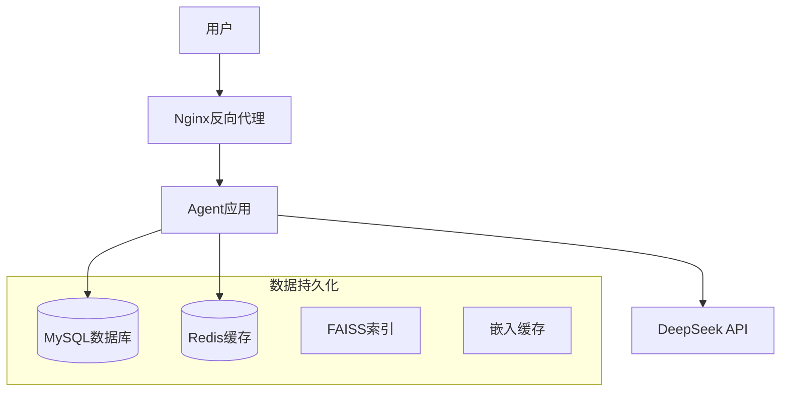

# Docker部署指南

## 概述

本指南详细介绍如何使用Docker部署Agent智能体系统，包括开发环境和生产环境的部署方式。

## 环境要求

### 系统要求

- **操作系统**: Linux/macOS/Windows
- **Docker**: 20.10.0+
- **Docker Compose**: 2.0.0+
- **内存**: 最少4GB，推荐8GB+
- **磁盘空间**: 最少10GB可用空间
- **网络**: 能够访问DeepSeek API

### 硬件要求

| 环境 | CPU | 内存 | 磁盘 | 网络 |
|------|-----|------|------|------|
| 开发环境 | 2核+ | 4GB+ | 10GB+ | 10Mbps+ |
| 生产环境 | 4核+ | 8GB+ | 50GB+ | 100Mbps+ |

## 快速开始

### 1. 获取代码

```bash
# 克隆项目
git clone <repository-url>
cd agent-system

# 或者下载ZIP文件并解压
```

### 2. 配置环境变量

```bash
# 复制环境变量模板
cp .env.example .env

# 编辑环境变量
nano .env
```

**必需的环境变量**：

```bash
# DeepSeek API配置（必需）
DEEPSEEK_API_KEY=your_deepseek_api_key_here
DEEPSEEK_BASE_URL=https://api.deepseek.com

# 应用配置
APP_NAME=Agent智能体系统
APP_VERSION=1.0.0
LOG_LEVEL=INFO

# 数据库配置（可选，默认使用Docker配置）
DATABASE_URL=mysql+pymysql://agent_user:agent_password@db:3306/agent_db
```

### 3. 启动服务

#### 开发环境

```bash
# 启动基础服务
docker-compose up -d app db

# 查看启动日志
docker-compose logs -f app
```

#### 生产环境

```bash
# 启动完整服务栈
docker-compose --profile production up -d

# 查看所有服务状态
docker-compose ps
```

### 4. 验证部署

访问以下地址验证服务：

- **应用首页**: http://localhost:8000
- **API文档**: http://localhost:8000/docs
- **健康检查**: http://localhost:8000/health

## 服务架构

### 服务组件



### 服务说明

| 服务 | 端口 | 功能 | 依赖 |
|------|------|------|------|
| **app** | 8000 | 主应用服务 | MySQL, Redis |
| **db** | 3306 | MySQL数据库 | - |
| **redis** | 6379 | 缓存服务 | - |
| **nginx** | 80/443 | 反向代理 | app |

## 详细配置

### Docker Compose配置

#### 应用服务配置

```yaml
app:
  build: .
  container_name: agent-app
  ports:
    - "8000:8000"
  environment:
    - DATABASE_URL=mysql+pymysql://agent_user:agent_password@db:3306/agent_db
    - DEEPSEEK_API_KEY=${DEEPSEEK_API_KEY}
    - DEEPSEEK_BASE_URL=${DEEPSEEK_BASE_URL}
  volumes:
    - faiss_data:/app/data/faiss
    - embedding_data:/app/data/embeddings
    - app_logs:/app/logs
  depends_on:
    db:
      condition: service_healthy
  restart: unless-stopped
```

#### 数据库服务配置

```yaml
db:
  image: mysql:8.0
  container_name: agent-db
  environment:
    - MYSQL_ROOT_PASSWORD=root_password
    - MYSQL_DATABASE=agent_db
    - MYSQL_USER=agent_user
    - MYSQL_PASSWORD=agent_password
  volumes:
    - mysql_data:/var/lib/mysql
  healthcheck:
    test: ["CMD", "mysqladmin", "ping", "-h", "localhost"]
    interval: 10s
    timeout: 5s
    retries: 5
```

### 环境变量详解

#### 必需变量

| 变量名 | 说明 | 示例值 |
|--------|------|--------|
| `DEEPSEEK_API_KEY` | DeepSeek API密钥 | `sk-xxx...` |
| `DEEPSEEK_BASE_URL` | DeepSeek API地址 | `https://api.deepseek.com` |

#### 可选变量

| 变量名 | 说明 | 默认值 |
|--------|------|--------|
| `DATABASE_URL` | 数据库连接URL | `mysql+pymysql://agent_user:agent_password@db:3306/agent_db` |
| `APP_NAME` | 应用名称 | `Agent系统` |
| `APP_VERSION` | 应用版本 | `1.0.0` |
| `LOG_LEVEL` | 日志级别 | `INFO` |
| `FAISS_INDEX_PATH` | FAISS索引路径 | `/app/data/faiss` |
| `EMBEDDING_CACHE_PATH` | 嵌入缓存路径 | `/app/data/embeddings` |

## 数据持久化

### 数据卷说明

| 卷名 | 用途 | 数据内容 |
|------|------|----------|
| `mysql_data` | MySQL数据 | 数据库文件、表结构、数据 |
| `faiss_data` | 向量索引 | FAISS索引文件 |
| `embedding_data` | 嵌入缓存 | 文本嵌入向量缓存 |
| `app_logs` | 应用日志 | 应用运行日志 |
| `redis_data` | Redis数据 | 缓存数据、会话信息 |

### 数据备份

#### 数据库备份

```bash
# 创建数据库备份
docker-compose exec db mysqldump -u agent_user -p agent_db > backup_$(date +%Y%m%d_%H%M%S).sql

# 恢复数据库
docker-compose exec -T db mysql -u agent_user -p agent_db < backup_20240101_120000.sql
```

#### 数据卷备份

```bash
# 备份所有数据卷
docker run --rm \
  -v agent_mysql_data:/data/mysql \
  -v agent_faiss_data:/data/faiss \
  -v agent_embedding_data:/data/embeddings \
  -v $(pwd):/backup \
  alpine tar czf /backup/full_backup_$(date +%Y%m%d_%H%M%S).tar.gz /data
```

## 监控和日志

### 健康检查

```bash
# 检查应用健康状态
curl http://localhost:8000/health

# 检查所有服务状态
docker-compose ps

# 检查服务健康状态
docker-compose exec app python -c "import requests; print(requests.get('http://localhost:8000/health').json())"
```

### 日志查看

```bash
# 查看所有服务日志
docker-compose logs

# 查看特定服务日志
docker-compose logs app
docker-compose logs db

# 实时查看日志
docker-compose logs -f app

# 查看最近100行日志
docker-compose logs --tail=100 app
```

### 性能监控

```bash
# 查看容器资源使用情况
docker stats

# 查看特定容器资源使用
docker stats agent-app

# 进入容器查看系统信息
docker-compose exec app top
docker-compose exec app df -h
```

## 故障排除

### 常见问题

#### 1. 数据库连接失败

**症状**: 应用启动失败，日志显示数据库连接错误

**解决方案**:
```bash
# 检查数据库服务状态
docker-compose ps db

# 查看数据库日志
docker-compose logs db

# 重启数据库服务
docker-compose restart db

# 检查数据库连接
docker-compose exec app python -c "
from sqlalchemy import create_engine
engine = create_engine('${DATABASE_URL}')
with engine.connect() as conn:
    print('数据库连接成功')
"
```

#### 2. 应用启动失败

**症状**: 应用容器无法启动或立即退出

**解决方案**:
```bash
# 查看应用日志
docker-compose logs app

# 检查环境变量
docker-compose exec app env | grep -E "(DATABASE_URL|DEEPSEEK_API_KEY)"

# 重新构建镜像
docker-compose build app

# 重启应用
docker-compose restart app
```

#### 3. 端口冲突

**症状**: 服务启动失败，提示端口被占用

**解决方案**:
```bash
# 查看端口占用
netstat -tulpn | grep :8000

# 修改端口映射
# 编辑docker-compose.yml
ports:
  - "8001:8000"  # 改为其他端口

# 重启服务
docker-compose up -d
```

#### 4. 内存不足

**症状**: 容器被OOM杀死或响应缓慢

**解决方案**:
```bash
# 检查内存使用
docker stats

# 增加Docker内存限制
# 在docker-compose.yml中添加
deploy:
  resources:
    limits:
      memory: 4G
    reservations:
      memory: 2G

# 重启服务
docker-compose up -d
```

### 日志分析

#### 应用日志

```bash
# 查看错误日志
docker-compose logs app | grep ERROR

# 查看警告日志
docker-compose logs app | grep WARNING

# 查看特定时间段的日志
docker-compose logs app --since="2024-01-01T00:00:00" --until="2024-01-01T23:59:59"
```

#### 数据库日志

```bash
# 查看数据库错误日志
docker-compose logs db | grep ERROR

# 查看慢查询日志
docker-compose exec db mysql -u agent_user -p -e "SHOW VARIABLES LIKE 'slow_query_log';"
```

## 性能优化

### 应用优化

#### 1. 增加工作进程

```yaml
# 在docker-compose.yml中修改
command: uvicorn app.main:app --host 0.0.0.0 --port 8000 --workers 4
```

#### 2. 调整数据库连接池

```bash
# 在环境变量中设置
DATABASE_POOL_SIZE=20
DATABASE_MAX_OVERFLOW=30
```

#### 3. 启用Redis缓存

```yaml
# 在docker-compose.yml中启用Redis
redis:
  image: redis:7-alpine
  # ... 其他配置
```

### 系统优化

#### 1. 调整Docker资源限制

```yaml
# 在docker-compose.yml中添加
deploy:
  resources:
    limits:
      cpus: '2.0'
      memory: 4G
    reservations:
      cpus: '1.0'
      memory: 2G
```

#### 2. 优化数据库配置

```yaml
# 在docker-compose.yml中添加MySQL配置
command: >
  --default-authentication-plugin=mysql_native_password
  --innodb-buffer-pool-size=1G
  --max-connections=200
  --query-cache-size=64M
```

## 安全配置

### 生产环境安全

#### 1. 修改默认密码

```yaml
# 在docker-compose.yml中修改
environment:
  - MYSQL_ROOT_PASSWORD=your_secure_root_password
  - MYSQL_PASSWORD=your_secure_user_password
```

#### 2. 使用HTTPS

```bash
# 创建SSL证书目录
mkdir -p docker/ssl

# 将SSL证书文件放入docker/ssl目录
# 证书文件: server.crt, server.key
```

#### 3. 限制网络访问

```yaml
# 在docker-compose.yml中添加
networks:
  agent-network:
    driver: bridge
    internal: true  # 限制外部访问
```

#### 4. 设置防火墙

```bash
# 只允许必要端口
ufw allow 80
ufw allow 443
ufw allow 22
ufw enable
```

### 数据安全

#### 1. 数据加密

```bash
# 使用加密的数据卷
docker volume create --driver local \
  --opt type=tmpfs \
  --opt device=tmpfs \
  --opt o=size=1G,noexec,nosuid,nodev \
  secure_tmp
```

#### 2. 定期备份

```bash
# 创建自动备份脚本
cat > backup.sh << 'EOF'
#!/bin/bash
DATE=$(date +%Y%m%d_%H%M%S)
docker-compose exec db mysqldump -u agent_user -p agent_db > backup_${DATE}.sql
gzip backup_${DATE}.sql
# 上传到云存储
aws s3 cp backup_${DATE}.sql.gz s3://your-backup-bucket/
EOF

chmod +x backup.sh

# 设置定时任务
crontab -e
# 添加: 0 2 * * * /path/to/backup.sh
```

## 更新和维护

### 应用更新

```bash
# 拉取最新代码
git pull

# 重新构建镜像
docker-compose build app

# 滚动更新（零停机）
docker-compose up -d --no-deps app

# 验证更新
curl http://localhost:8000/health
```

### 数据库迁移

```bash
# 备份当前数据
docker-compose exec db mysqldump -u agent_user -p agent_db > pre_migration_backup.sql

# 运行迁移脚本
docker-compose exec app python scripts/migrate.py

# 验证迁移结果
docker-compose exec db mysql -u agent_user -p agent_db -e "SHOW TABLES;"
```

### 清理和维护

```bash
# 清理未使用的镜像
docker image prune

# 清理未使用的数据卷
docker volume prune

# 清理未使用的网络
docker network prune

# 清理所有未使用的资源
docker system prune -a

# 查看磁盘使用情况
docker system df
```

## 扩展部署

### 水平扩展

```yaml
# 在docker-compose.yml中添加负载均衡
nginx:
  image: nginx:alpine
  ports:
    - "80:80"
  volumes:
    - ./nginx.conf:/etc/nginx/nginx.conf
  depends_on:
    - app1
    - app2
    - app3

app1:
  # ... 应用配置
app2:
  # ... 应用配置
app3:
  # ... 应用配置
```

### 集群部署

```yaml
# 使用Docker Swarm
version: '3.8'
services:
  app:
    image: agent-app:latest
    deploy:
      replicas: 3
      placement:
        constraints:
          - node.role == worker
      resources:
        limits:
          memory: 2G
        reservations:
          memory: 1G
```

## 监控和告警

### 监控配置

```yaml
# 添加监控服务
prometheus:
  image: prom/prometheus
  ports:
    - "9090:9090"
  volumes:
    - ./prometheus.yml:/etc/prometheus/prometheus.yml

grafana:
  image: grafana/grafana
  ports:
    - "3000:3000"
  environment:
    - GF_SECURITY_ADMIN_PASSWORD=admin
```

### 告警配置

```yaml
# 添加告警服务
alertmanager:
  image: prom/alertmanager
  ports:
    - "9093:9093"
  volumes:
    - ./alertmanager.yml:/etc/alertmanager/alertmanager.yml
```

## 总结

本指南涵盖了Docker部署Agent系统的各个方面，包括：

1. **环境准备**: 系统要求、环境变量配置
2. **服务部署**: 开发环境和生产环境部署
3. **数据管理**: 持久化、备份、恢复
4. **监控运维**: 日志查看、性能监控、故障排除
5. **安全配置**: 生产环境安全最佳实践
6. **扩展部署**: 水平扩展、集群部署

通过遵循本指南，您可以成功部署和维护Agent智能体系统。
