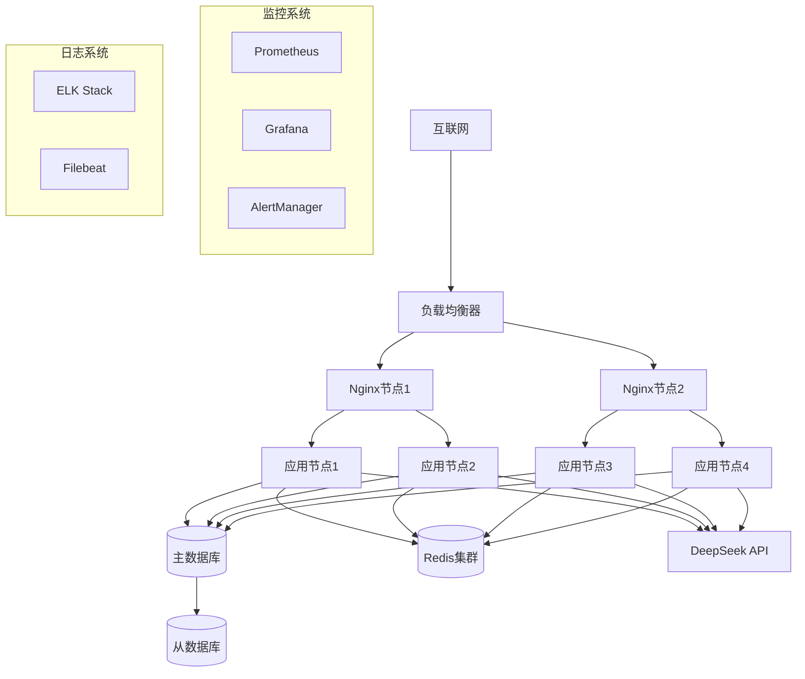

# 生产环境部署指南

## 概述

本指南专门针对生产环境部署Agent智能体系统，涵盖高可用性、安全性、性能优化和运维监控等方面。

## 生产环境架构

### 推荐架构



### 组件说明

| 组件 | 数量 | 规格 | 用途 |
|------|------|------|------|
| **负载均衡器** | 2+ | 2核4G | 流量分发、SSL终止 |
| **应用节点** | 4+ | 4核8G | 业务逻辑处理 |
| **数据库主库** | 1 | 8核16G | 数据写入 |
| **数据库从库** | 2+ | 4核8G | 数据读取 |
| **Redis集群** | 3+ | 2核4G | 缓存、会话存储 |
| **监控节点** | 1 | 2核4G | 监控数据收集 |

## 环境准备

### 服务器要求

#### 最低配置

| 角色 | CPU | 内存 | 磁盘 | 网络 |
|------|-----|------|------|------|
| 应用服务器 | 4核 | 8GB | 100GB SSD | 1Gbps |
| 数据库服务器 | 8核 | 16GB | 500GB SSD | 1Gbps |
| 缓存服务器 | 2核 | 4GB | 50GB SSD | 1Gbps |
| 监控服务器 | 2核 | 4GB | 100GB SSD | 100Mbps |

#### 推荐配置

| 角色 | CPU | 内存 | 磁盘 | 网络 |
|------|-----|------|------|------|
| 应用服务器 | 8核 | 16GB | 200GB NVMe SSD | 10Gbps |
| 数据库服务器 | 16核 | 32GB | 1TB NVMe SSD | 10Gbps |
| 缓存服务器 | 4核 | 8GB | 100GB NVMe SSD | 1Gbps |
| 监控服务器 | 4核 | 8GB | 200GB SSD | 1Gbps |

### 操作系统配置

#### 系统优化

```bash
# 1. 更新系统
sudo apt update && sudo apt upgrade -y

# 2. 安装必要软件
sudo apt install -y curl wget git vim htop iotop nethogs

# 3. 配置时区
sudo timedatectl set-timezone Asia/Shanghai

# 4. 配置主机名
sudo hostnamectl set-hostname agent-prod-01

# 5. 配置DNS
echo "nameserver 8.8.8.8" | sudo tee -a /etc/resolv.conf
echo "nameserver 8.8.4.4" | sudo tee -a /etc/resolv.conf
```

#### 内核参数优化

```bash
# 编辑内核参数
sudo vim /etc/sysctl.conf

# 添加以下配置
net.core.somaxconn = 65535
net.core.netdev_max_backlog = 5000
net.ipv4.tcp_max_syn_backlog = 65535
net.ipv4.tcp_fin_timeout = 10
net.ipv4.tcp_tw_reuse = 1
net.ipv4.tcp_timestamps = 1
net.ipv4.tcp_keepalive_time = 1200
net.ipv4.tcp_keepalive_intvl = 15
net.ipv4.tcp_keepalive_probes = 5
vm.swappiness = 10
vm.dirty_ratio = 15
vm.dirty_background_ratio = 5

# 应用配置
sudo sysctl -p
```

#### 文件系统优化

```bash
# 1. 挂载选项优化
sudo vim /etc/fstab

# 添加noatime选项
/dev/sda1 / ext4 defaults,noatime 0 1

# 2. 创建应用目录
sudo mkdir -p /opt/agent-system
sudo mkdir -p /var/log/agent-system
sudo mkdir -p /var/lib/agent-system

# 3. 设置权限
sudo chown -R agent:agent /opt/agent-system
sudo chown -R agent:agent /var/log/agent-system
sudo chown -R agent:agent /var/lib/agent-system
```

## Docker环境配置

### Docker安装和配置

```bash
# 1. 安装Docker
curl -fsSL https://get.docker.com -o get-docker.sh
sudo sh get-docker.sh

# 2. 安装Docker Compose
sudo curl -L "https://github.com/docker/compose/releases/latest/download/docker-compose-$(uname -s)-$(uname -m)" -o /usr/local/bin/docker-compose
sudo chmod +x /usr/local/bin/docker-compose

# 3. 配置Docker
sudo vim /etc/docker/daemon.json

{
  "log-driver": "json-file",
  "log-opts": {
    "max-size": "100m",
    "max-file": "3"
  },
  "storage-driver": "overlay2",
  "storage-opts": [
    "overlay2.override_kernel_check=true"
  ],
  "live-restore": true,
  "userland-proxy": false,
  "experimental": false,
  "metrics-addr": "0.0.0.0:9323",
  "default-address-pools": [
    {
      "base": "172.17.0.0/12",
      "size": 24
    }
  ]
}

# 4. 重启Docker
sudo systemctl restart docker
sudo systemctl enable docker
```

### 生产环境Docker Compose

```yaml
version: '3.8'

services:
  # 应用服务
  app:
    build: .
    container_name: agent-app
    restart: unless-stopped
    environment:
      - DATABASE_URL=mysql+pymysql://agent_user:${DB_PASSWORD}@db:3306/agent_db
      - DEEPSEEK_API_KEY=${DEEPSEEK_API_KEY}
      - DEEPSEEK_BASE_URL=${DEEPSEEK_BASE_URL}
      - REDIS_URL=redis://redis:6379/0
      - LOG_LEVEL=INFO
      - WORKERS=4
    volumes:
      - app_data:/app/data
      - app_logs:/app/logs
    depends_on:
      db:
        condition: service_healthy
      redis:
        condition: service_healthy
    deploy:
      resources:
        limits:
          cpus: '4.0'
          memory: 8G
        reservations:
          cpus: '2.0'
          memory: 4G
    healthcheck:
      test: ["CMD", "curl", "-f", "http://localhost:8000/health"]
      interval: 30s
      timeout: 10s
      retries: 3
      start_period: 40s
    networks:
      - agent-network

  # 数据库服务
  db:
    image: mysql:8.0
    container_name: agent-db
    restart: unless-stopped
    environment:
      - MYSQL_ROOT_PASSWORD=${DB_ROOT_PASSWORD}
      - MYSQL_DATABASE=agent_db
      - MYSQL_USER=agent_user
      - MYSQL_PASSWORD=${DB_PASSWORD}
    volumes:
      - db_data:/var/lib/mysql
      - ./mysql.cnf:/etc/mysql/conf.d/custom.cnf:ro
    command: >
      --default-authentication-plugin=mysql_native_password
      --innodb-buffer-pool-size=8G
      --max-connections=500
      --query-cache-size=256M
      --slow-query-log=1
      --slow-query-log-file=/var/log/mysql/slow.log
      --long-query-time=2
    healthcheck:
      test: ["CMD", "mysqladmin", "ping", "-h", "localhost", "-u", "agent_user", "-p${DB_PASSWORD}"]
      interval: 10s
      timeout: 5s
      retries: 5
    deploy:
      resources:
        limits:
          cpus: '8.0'
          memory: 16G
        reservations:
          cpus: '4.0'
          memory: 8G
    networks:
      - agent-network

  # Redis缓存
  redis:
    image: redis:7-alpine
    container_name: agent-redis
    restart: unless-stopped
    command: redis-server --appendonly yes --maxmemory 2gb --maxmemory-policy allkeys-lru
    volumes:
      - redis_data:/data
    healthcheck:
      test: ["CMD", "redis-cli", "ping"]
      interval: 10s
      timeout: 5s
      retries: 5
    deploy:
      resources:
        limits:
          cpus: '2.0'
          memory: 4G
        reservations:
          cpus: '1.0'
          memory: 2G
    networks:
      - agent-network

  # Nginx反向代理
  nginx:
    image: nginx:alpine
    container_name: agent-nginx
    restart: unless-stopped
    ports:
      - "80:80"
      - "443:443"
    volumes:
      - ./nginx.conf:/etc/nginx/nginx.conf:ro
      - ./ssl:/etc/nginx/ssl:ro
      - nginx_logs:/var/log/nginx
    depends_on:
      - app
    deploy:
      resources:
        limits:
          cpus: '2.0'
          memory: 2G
        reservations:
          cpus: '1.0'
          memory: 1G
    networks:
      - agent-network

# 数据卷
volumes:
  app_data:
    driver: local
  app_logs:
    driver: local
  db_data:
    driver: local
  redis_data:
    driver: local
  nginx_logs:
    driver: local

# 网络
networks:
  agent-network:
    driver: bridge
    ipam:
      config:
        - subnet: 172.20.0.0/16
```

## 数据库配置

### MySQL生产配置

```ini
# mysql.cnf
[mysqld]
# 基础配置
port = 3306
bind-address = 0.0.0.0
max_connections = 500
max_connect_errors = 1000

# 字符集
character-set-server = utf8mb4
collation-server = utf8mb4_unicode_ci

# InnoDB配置
innodb_buffer_pool_size = 8G
innodb_log_file_size = 1G
innodb_log_buffer_size = 64M
innodb_flush_log_at_trx_commit = 2
innodb_file_per_table = 1
innodb_open_files = 4000

# 查询缓存
query_cache_type = 1
query_cache_size = 256M
query_cache_limit = 2M

# 慢查询日志
slow_query_log = 1
slow_query_log_file = /var/log/mysql/slow.log
long_query_time = 2
log_queries_not_using_indexes = 1

# 二进制日志
log-bin = mysql-bin
binlog_format = ROW
expire_logs_days = 7
max_binlog_size = 1G

# 安全配置
local_infile = 0
skip_name_resolve = 1

[mysql]
default-character-set = utf8mb4

[client]
default-character-set = utf8mb4
```

### 数据库优化

```sql
-- 创建数据库用户
CREATE USER 'agent_user'@'%' IDENTIFIED BY 'secure_password';
GRANT SELECT, INSERT, UPDATE, DELETE, CREATE, DROP, INDEX, ALTER ON agent_db.* TO 'agent_user'@'%';
FLUSH PRIVILEGES;

-- 创建索引
USE agent_db;

-- 会话表索引
CREATE INDEX idx_conversations_user_id ON conversations(user_id);
CREATE INDEX idx_conversations_created_at ON conversations(created_at);

-- 消息表索引
CREATE INDEX idx_messages_conversation_id ON messages(conversation_id);
CREATE INDEX idx_messages_created_at ON messages(created_at);

-- 任务表索引
CREATE INDEX idx_tasks_conversation_id ON tasks(conversation_id);
CREATE INDEX idx_tasks_status ON tasks(status);
CREATE INDEX idx_tasks_created_at ON tasks(created_at);

-- 记忆表索引
CREATE INDEX idx_memory_store_conversation_id ON memory_store(conversation_id);
CREATE INDEX idx_memory_store_memory_type ON memory_store(memory_type);
CREATE INDEX idx_memory_store_importance_score ON memory_store(importance_score);

-- 知识图谱表索引
CREATE INDEX idx_knowledge_graph_user_id ON knowledge_graph(user_id);
CREATE INDEX idx_knowledge_graph_entity_type ON knowledge_graph(entity_type);
CREATE INDEX idx_knowledge_relation_from_entity ON knowledge_relation(from_entity_id);
CREATE INDEX idx_knowledge_relation_to_entity ON knowledge_relation(to_entity_id);
```

## 负载均衡配置

### Nginx配置

```nginx
# nginx.conf
user nginx;
worker_processes auto;
error_log /var/log/nginx/error.log warn;
pid /var/run/nginx.pid;

events {
    worker_connections 1024;
    use epoll;
    multi_accept on;
}

http {
    include /etc/nginx/mime.types;
    default_type application/octet-stream;

    # 日志格式
    log_format main '$remote_addr - $remote_user [$time_local] "$request" '
                    '$status $body_bytes_sent "$http_referer" '
                    '"$http_user_agent" "$http_x_forwarded_for" '
                    'rt=$request_time uct="$upstream_connect_time" '
                    'uht="$upstream_header_time" urt="$upstream_response_time"';

    access_log /var/log/nginx/access.log main;

    # 基础配置
    sendfile on;
    tcp_nopush on;
    tcp_nodelay on;
    keepalive_timeout 65;
    types_hash_max_size 2048;
    client_max_body_size 10M;

    # Gzip压缩
    gzip on;
    gzip_vary on;
    gzip_min_length 1024;
    gzip_proxied any;
    gzip_comp_level 6;
    gzip_types
        text/plain
        text/css
        text/xml
        text/javascript
        application/json
        application/javascript
        application/xml+rss
        application/atom+xml
        image/svg+xml;

    # 上游服务器
    upstream agent_backend {
        least_conn;
        server app:8000 max_fails=3 fail_timeout=30s;
        keepalive 32;
    }

    # HTTP重定向到HTTPS
    server {
        listen 80;
        server_name your-domain.com;
        return 301 https://$server_name$request_uri;
    }

    # HTTPS服务器
    server {
        listen 443 ssl http2;
        server_name your-domain.com;

        # SSL配置
        ssl_certificate /etc/nginx/ssl/server.crt;
        ssl_certificate_key /etc/nginx/ssl/server.key;
        ssl_protocols TLSv1.2 TLSv1.3;
        ssl_ciphers ECDHE-RSA-AES128-GCM-SHA256:ECDHE-RSA-AES256-GCM-SHA384;
        ssl_prefer_server_ciphers off;
        ssl_session_cache shared:SSL:10m;
        ssl_session_timeout 10m;

        # 安全头
        add_header X-Frame-Options DENY;
        add_header X-Content-Type-Options nosniff;
        add_header X-XSS-Protection "1; mode=block";
        add_header Strict-Transport-Security "max-age=31536000; includeSubDomains" always;

        # 代理配置
        location / {
            proxy_pass http://agent_backend;
            proxy_set_header Host $host;
            proxy_set_header X-Real-IP $remote_addr;
            proxy_set_header X-Forwarded-For $proxy_add_x_forwarded_for;
            proxy_set_header X-Forwarded-Proto $scheme;
            
            # 超时配置
            proxy_connect_timeout 30s;
            proxy_send_timeout 30s;
            proxy_read_timeout 30s;
            
            # 缓冲配置
            proxy_buffering on;
            proxy_buffer_size 4k;
            proxy_buffers 8 4k;
            proxy_busy_buffers_size 8k;
        }

        # 健康检查
        location /health {
            proxy_pass http://agent_backend/health;
            access_log off;
        }

        # 静态文件
        location /static/ {
            alias /app/static/;
            expires 1y;
            add_header Cache-Control "public, immutable";
        }
    }
}
```

## 监控系统

### Prometheus配置

```yaml
# prometheus.yml
global:
  scrape_interval: 15s
  evaluation_interval: 15s

rule_files:
  - "alert_rules.yml"

alerting:
  alertmanagers:
    - static_configs:
        - targets:
          - alertmanager:9093

scrape_configs:
  - job_name: 'agent-app'
    static_configs:
      - targets: ['app:8000']
    metrics_path: '/metrics'
    scrape_interval: 10s

  - job_name: 'mysql'
    static_configs:
      - targets: ['db:9104']

  - job_name: 'redis'
    static_configs:
      - targets: ['redis:6379']

  - job_name: 'nginx'
    static_configs:
      - targets: ['nginx:9113']
```

### Grafana仪表板

```json
{
  "dashboard": {
    "title": "Agent System Dashboard",
    "panels": [
      {
        "title": "Request Rate",
        "type": "graph",
        "targets": [
          {
            "expr": "rate(http_requests_total[5m])",
            "legendFormat": "{{method}} {{endpoint}}"
          }
        ]
      },
      {
        "title": "Response Time",
        "type": "graph",
        "targets": [
          {
            "expr": "histogram_quantile(0.95, rate(http_request_duration_seconds_bucket[5m]))",
            "legendFormat": "95th percentile"
          }
        ]
      },
      {
        "title": "Error Rate",
        "type": "graph",
        "targets": [
          {
            "expr": "rate(http_requests_total{status=~\"5..\"}[5m])",
            "legendFormat": "5xx errors"
          }
        ]
      },
      {
        "title": "Database Connections",
        "type": "graph",
        "targets": [
          {
            "expr": "mysql_global_status_threads_connected",
            "legendFormat": "Connected"
          }
        ]
      }
    ]
  }
}
```

### 告警规则

```yaml
# alert_rules.yml
groups:
  - name: agent-system
    rules:
      - alert: HighErrorRate
        expr: rate(http_requests_total{status=~"5.."}[5m]) > 0.1
        for: 2m
        labels:
          severity: critical
        annotations:
          summary: "High error rate detected"
          description: "Error rate is {{ $value }} errors per second"

      - alert: HighResponseTime
        expr: histogram_quantile(0.95, rate(http_request_duration_seconds_bucket[5m])) > 2
        for: 5m
        labels:
          severity: warning
        annotations:
          summary: "High response time"
          description: "95th percentile response time is {{ $value }}s"

      - alert: DatabaseDown
        expr: mysql_up == 0
        for: 1m
        labels:
          severity: critical
        annotations:
          summary: "Database is down"
          description: "MySQL database is not responding"

      - alert: HighMemoryUsage
        expr: (node_memory_MemTotal_bytes - node_memory_MemAvailable_bytes) / node_memory_MemTotal_bytes > 0.9
        for: 5m
        labels:
          severity: warning
        annotations:
          summary: "High memory usage"
          description: "Memory usage is {{ $value | humanizePercentage }}"
```

## 日志管理

### ELK Stack配置

```yaml
# docker-compose.logging.yml
version: '3.8'

services:
  elasticsearch:
    image: docker.elastic.co/elasticsearch/elasticsearch:8.8.0
    container_name: elasticsearch
    environment:
      - discovery.type=single-node
      - "ES_JAVA_OPTS=-Xms2g -Xmx2g"
    volumes:
      - es_data:/usr/share/elasticsearch/data
    ports:
      - "9200:9200"

  logstash:
    image: docker.elastic.co/logstash/logstash:8.8.0
    container_name: logstash
    volumes:
      - ./logstash.conf:/usr/share/logstash/pipeline/logstash.conf
    depends_on:
      - elasticsearch

  kibana:
    image: docker.elastic.co/kibana/kibana:8.8.0
    container_name: kibana
    ports:
      - "5601:5601"
    depends_on:
      - elasticsearch

  filebeat:
    image: docker.elastic.co/beats/filebeat:8.8.0
    container_name: filebeat
    user: root
    volumes:
      - ./filebeat.yml:/usr/share/filebeat/filebeat.yml
      - /var/lib/docker/containers:/var/lib/docker/containers:ro
      - /var/run/docker.sock:/var/run/docker.sock:ro
    depends_on:
      - logstash

volumes:
  es_data:
```

### Logstash配置

```ruby
# logstash.conf
input {
  beats {
    port => 5044
  }
}

filter {
  if [fields][service] == "agent-app" {
    grok {
      match => { "message" => "%{TIMESTAMP_ISO8601:timestamp} \| %{LOGLEVEL:level} \| %{DATA:logger} \| %{GREEDYDATA:message}" }
    }
    
    date {
      match => [ "timestamp", "ISO8601" ]
    }
    
    if [level] == "ERROR" {
      mutate {
        add_tag => [ "error" ]
      }
    }
  }
}

output {
  elasticsearch {
    hosts => ["elasticsearch:9200"]
    index => "agent-logs-%{+YYYY.MM.dd}"
  }
}
```

## 安全配置

### 防火墙配置

```bash
# 安装UFW
sudo apt install ufw

# 配置防火墙规则
sudo ufw default deny incoming
sudo ufw default allow outgoing

# 允许SSH
sudo ufw allow 22/tcp

# 允许HTTP和HTTPS
sudo ufw allow 80/tcp
sudo ufw allow 443/tcp

# 允许监控端口（仅内网）
sudo ufw allow from 10.0.0.0/8 to any port 9090
sudo ufw allow from 10.0.0.0/8 to any port 3000

# 启用防火墙
sudo ufw enable
```

### SSL证书配置

```bash
# 使用Let's Encrypt获取免费SSL证书
sudo apt install certbot python3-certbot-nginx

# 获取证书
sudo certbot --nginx -d your-domain.com

# 自动续期
sudo crontab -e
# 添加: 0 12 * * * /usr/bin/certbot renew --quiet
```

### 应用安全配置

```python
# 在app/main.py中添加安全中间件
from fastapi.middleware.trustedhost import TrustedHostMiddleware
from fastapi.middleware.cors import CORSMiddleware

# 信任主机
app.add_middleware(
    TrustedHostMiddleware, 
    allowed_hosts=["your-domain.com", "*.your-domain.com"]
)

# CORS配置
app.add_middleware(
    CORSMiddleware,
    allow_origins=["https://your-domain.com"],
    allow_credentials=True,
    allow_methods=["GET", "POST"],
    allow_headers=["*"],
)
```

## 备份策略

### 自动备份脚本

```bash
#!/bin/bash
# backup.sh

# 配置
BACKUP_DIR="/backup"
DATE=$(date +%Y%m%d_%H%M%S)
RETENTION_DAYS=30

# 创建备份目录
mkdir -p $BACKUP_DIR

# 数据库备份
echo "开始数据库备份..."
docker-compose exec -T db mysqldump -u agent_user -p${DB_PASSWORD} agent_db | gzip > $BACKUP_DIR/db_backup_$DATE.sql.gz

# 应用数据备份
echo "开始应用数据备份..."
docker run --rm \
  -v agent_app_data:/data \
  -v $BACKUP_DIR:/backup \
  alpine tar czf /backup/app_data_$DATE.tar.gz /data

# 配置文件备份
echo "开始配置文件备份..."
tar czf $BACKUP_DIR/config_$DATE.tar.gz docker-compose.yml nginx.conf .env

# 清理旧备份
echo "清理旧备份..."
find $BACKUP_DIR -name "*.gz" -mtime +$RETENTION_DAYS -delete

# 上传到云存储（可选）
# aws s3 sync $BACKUP_DIR s3://your-backup-bucket/

echo "备份完成: $DATE"
```

### 定时备份

```bash
# 设置定时任务
crontab -e

# 每天凌晨2点执行备份
0 2 * * * /path/to/backup.sh >> /var/log/backup.log 2>&1
```

## 性能优化

### 应用优化

```python
# 在app/main.py中配置
from fastapi import FastAPI
import uvicorn

app = FastAPI()

# 启动配置
if __name__ == "__main__":
    uvicorn.run(
        "app.main:app",
        host="0.0.0.0",
        port=8000,
        workers=4,  # 根据CPU核心数调整
        worker_class="uvicorn.workers.UvicornWorker",
        access_log=True,
        log_level="info"
    )
```

### 数据库优化

```sql
-- 定期优化表
OPTIMIZE TABLE conversations, messages, tasks, memory_store, knowledge_graph;

-- 分析表统计信息
ANALYZE TABLE conversations, messages, tasks, memory_store, knowledge_graph;
```

### 缓存优化

```python
# Redis配置优化
REDIS_CONFIG = {
    "host": "redis",
    "port": 6379,
    "db": 0,
    "max_connections": 20,
    "retry_on_timeout": True,
    "socket_keepalive": True,
    "socket_keepalive_options": {},
}
```

## 运维脚本

### 健康检查脚本

```bash
#!/bin/bash
# health_check.sh

# 检查应用健康状态
check_app() {
    local response=$(curl -s -o /dev/null -w "%{http_code}" http://localhost:8000/health)
    if [ "$response" = "200" ]; then
        echo "✓ 应用服务正常"
        return 0
    else
        echo "✗ 应用服务异常 (HTTP $response)"
        return 1
    fi
}

# 检查数据库连接
check_database() {
    if docker-compose exec -T db mysqladmin ping -h localhost -u agent_user -p${DB_PASSWORD} > /dev/null 2>&1; then
        echo "✓ 数据库连接正常"
        return 0
    else
        echo "✗ 数据库连接异常"
        return 1
    fi
}

# 检查Redis连接
check_redis() {
    if docker-compose exec -T redis redis-cli ping > /dev/null 2>&1; then
        echo "✓ Redis连接正常"
        return 0
    else
        echo "✗ Redis连接异常"
        return 1
    fi
}

# 执行所有检查
echo "开始健康检查..."
check_app && check_database && check_redis

if [ $? -eq 0 ]; then
    echo "✓ 所有服务正常"
    exit 0
else
    echo "✗ 部分服务异常"
    exit 1
fi
```

### 部署脚本

```bash
#!/bin/bash
# deploy.sh

set -e

echo "开始部署..."

# 1. 拉取最新代码
git pull origin main

# 2. 备份当前版本
./backup.sh

# 3. 构建新镜像
docker-compose build app

# 4. 停止旧服务
docker-compose stop app

# 5. 启动新服务
docker-compose up -d app

# 6. 等待服务启动
sleep 30

# 7. 健康检查
./health_check.sh

if [ $? -eq 0 ]; then
    echo "✓ 部署成功"
else
    echo "✗ 部署失败，回滚..."
    docker-compose stop app
    docker-compose up -d app
    exit 1
fi
```

## 总结

本生产环境部署指南涵盖了：

1. **架构设计**: 高可用、可扩展的架构
2. **环境配置**: 系统优化、Docker配置
3. **数据库配置**: MySQL生产级配置
4. **负载均衡**: Nginx反向代理配置
5. **监控系统**: Prometheus + Grafana
6. **日志管理**: ELK Stack
7. **安全配置**: 防火墙、SSL、应用安全
8. **备份策略**: 自动备份和恢复
9. **性能优化**: 应用、数据库、缓存优化
10. **运维脚本**: 健康检查、部署脚本

通过遵循本指南，您可以构建一个稳定、安全、高性能的Agent智能体系统生产环境。
