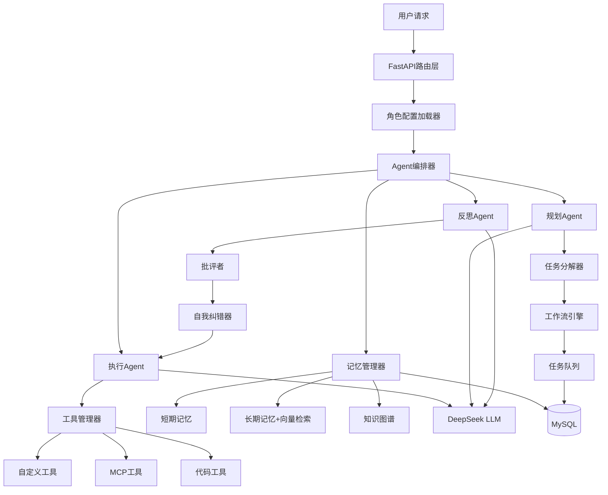

<!-- 90c32e13-49d1-4cd5-9cf1-f3e9501d71fc 0a8a81d2-2a50-4ca0-aaf9-5475be821186 -->
# 智能体系统完善 - 总体迭代计划

## 项目目标

构建一个**生产级智能体系统**，具备以下核心能力：

1. 自主任务规划与分解（类似AutoGPT/BabyAGI）
2. 复杂工作流编排（DAG + 条件分支 + 循环）
3. 分层记忆管理（短期/长期 + 向量检索 + 知识图谱）
4. 自主决策与反思（质量评估 + 自我纠错）
5. 代码理解与生成（codebase搜索 + 代码分析）
6. 多角色支持（统一Agent核心 + 角色配置层）

## 系统核心模块划分

```
app/core/
├── agent/                    # Agent核心（统一智能体引擎）
│   ├── base.py              # Agent基类
│   ├── planner_agent.py     # 规划Agent（任务分解与编排）⭐ 新增
│   ├── executor_agent.py    # 执行Agent（工具调用与反思）⭐ 新增
│   └── orchestrator.py      # 编排器（协调规划与执行）⭐ 新增
│
├── planning/                 # 任务规划模块 ⭐ 新增
│   ├── task_decomposer.py   # 任务分解器
│   ├── workflow_engine.py   # 工作流引擎（DAG执行）
│   ├── plan_validator.py    # 计划验证器
│   └── schemas.py           # 任务/计划数据结构
│
├── memory/                   # 记忆管理模块
│   ├── context_builder.py   # 上下文构建（已有）
│   ├── memory_manager.py    # 记忆管理器 ⭐ 新增
│   ├── short_term.py        # 短期记忆（会话级）⭐ 新增
│   ├── long_term.py         # 长期记忆（持久化 + 向量检索）⭐ 新增
│   ├── knowledge_graph.py   # 知识图谱（实体关系）⭐ 新增
│   └── summarizer.py        # 摘要生成器 ⭐ 新增
│
├── reflection/               # 反思模块 ⭐ 新增
│   ├── critic.py            # 批评者（评估输出质量）
│   ├── self_corrector.py    # 自我纠错器
│   └── quality_scorer.py    # 质量评分器
│
├── codebase/                 # 代码理解模块 ⭐ 新增
│   ├── indexer.py           # 代码索引器
│   ├── searcher.py          # 语义搜索
│   ├── analyzer.py          # 代码分析器
│   └── embeddings.py        # 向量嵌入
│
├── roles/                    # 角色配置模块 ⭐ 新增
│   ├── role_manager.py      # 角色管理器
│   ├── role_config.py       # 角色配置加载
│   └── configs/             # 角色配置文件
│       ├── general.yaml     # 通用助手
│       ├── customer_service.yaml  # 电商客服
│       └── code_assistant.yaml    # 代码助手
│
├── llm/                      # LLM适配（已有）
├── mcp/                      # MCP集成（已有）
└── tools/                    # 工具系统（已有）
```

## 数据库设计扩展

### 新增表结构

#### 1. 任务表 (task)

```sql
CREATE TABLE `task` (
    `id` BIGINT UNSIGNED NOT NULL AUTO_INCREMENT,
    `conversation_id` BIGINT UNSIGNED NOT NULL,
    `parent_task_id` BIGINT UNSIGNED DEFAULT NULL,
    `task_type` VARCHAR(50) NOT NULL,  -- 'plan', 'execute', 'reflect'
    `description` TEXT NOT NULL,
    `status` VARCHAR(20) NOT NULL,     -- 'pending', 'running', 'completed', 'failed'
    `priority` INT DEFAULT 0,
    `dependencies` JSON DEFAULT NULL,   -- 依赖任务ID列表
    `result` TEXT DEFAULT NULL,
    `metadata` JSON DEFAULT NULL,
    `created_at` DATETIME NOT NULL DEFAULT CURRENT_TIMESTAMP,
    `updated_at` DATETIME NOT NULL DEFAULT CURRENT_TIMESTAMP ON UPDATE CURRENT_TIMESTAMP,
    PRIMARY KEY (`id`),
    KEY `idx_conversation_id` (`conversation_id`),
    KEY `idx_parent_task_id` (`parent_task_id`),
    KEY `idx_status` (`status`)
) ENGINE=InnoDB DEFAULT CHARSET=utf8mb4;
```

#### 2. 记忆存储表 (memory_store)

```sql
CREATE TABLE `memory_store` (
    `id` BIGINT UNSIGNED NOT NULL AUTO_INCREMENT,
    `conversation_id` BIGINT UNSIGNED NOT NULL,
    `memory_type` VARCHAR(20) NOT NULL,  -- 'short_term', 'long_term', 'episodic'
    `content` TEXT NOT NULL,
    `embedding` BLOB DEFAULT NULL,       -- 向量嵌入（可选）
    `importance_score` FLOAT DEFAULT 0,
    `access_count` INT DEFAULT 0,
    `last_accessed_at` DATETIME DEFAULT NULL,
    `expires_at` DATETIME DEFAULT NULL,
    `metadata` JSON DEFAULT NULL,
    `created_at` DATETIME NOT NULL DEFAULT CURRENT_TIMESTAMP,
    PRIMARY KEY (`id`),
    KEY `idx_conversation_memory` (`conversation_id`, `memory_type`),
    KEY `idx_importance` (`importance_score`)
) ENGINE=InnoDB DEFAULT CHARSET=utf8mb4;
```

#### 3. 知识图谱表 (knowledge_graph)

```sql
CREATE TABLE `knowledge_graph` (
    `id` BIGINT UNSIGNED NOT NULL AUTO_INCREMENT,
    `user_id` BIGINT UNSIGNED NOT NULL,
    `entity_type` VARCHAR(50) NOT NULL,
    `entity_name` VARCHAR(200) NOT NULL,
    `properties` JSON DEFAULT NULL,
    `created_at` DATETIME NOT NULL DEFAULT CURRENT_TIMESTAMP,
    PRIMARY KEY (`id`),
    KEY `idx_user_entity` (`user_id`, `entity_type`)
) ENGINE=InnoDB DEFAULT CHARSET=utf8mb4;

CREATE TABLE `knowledge_relation` (
    `id` BIGINT UNSIGNED NOT NULL AUTO_INCREMENT,
    `from_entity_id` BIGINT UNSIGNED NOT NULL,
    `to_entity_id` BIGINT UNSIGNED NOT NULL,
    `relation_type` VARCHAR(50) NOT NULL,
    `weight` FLOAT DEFAULT 1.0,
    `created_at` DATETIME NOT NULL DEFAULT CURRENT_TIMESTAMP,
    PRIMARY KEY (`id`),
    KEY `idx_from_entity` (`from_entity_id`),
    KEY `idx_to_entity` (`to_entity_id`)
) ENGINE=InnoDB DEFAULT CHARSET=utf8mb4;
```

## 整体架构图（Mermaid）



## 迭代计划与执行顺序

### 阶段 0：基础设施准备（1-2天）

- 创建新数据库表结构
- 设计核心数据模型（Task、Memory、KnowledgeGraph）
- 建立项目记忆机制（docs/memory/）

### 阶段 1：任务规划系统（3-5天）⭐ 最高优先级

- 实现任务分解器（将用户请求分解为子任务）
- 实现工作流引擎（DAG执行 + 条件分支 + 循环）
- 实现规划Agent（生成执行计划）
- 集成LangGraph的Plan-and-Execute模式

### 阶段 2：反思与自我纠错（2-3天）

- 实现批评者模块（评估输出质量）
- 实现自我纠错器（根据反馈重新执行）
- 集成Reflexion模式

### 阶段 3：分层记忆管理（3-4天）

- 实现短期记忆（会话级缓存）
- 实现长期记忆（向量数据库 + 语义检索）
- 实现知识图谱（实体关系提取与存储）
- 实现记忆压缩与遗忘机制

### 阶段 4：代码理解能力（4-5天）

- 实现代码索引器（AST解析 + 向量化）
- 实现语义搜索（基于Embedding）
- 实现代码分析器（依赖分析、调用链）
- 集成到工具系统

### 阶段 5：多角色支持（2-3天）

- 实现角色配置管理器
- 创建角色配置文件（提示词 + 工具权限 + 工作流）
- 实现动态角色加载
- 重构API层支持角色参数

### 阶段 6：Agent编排器（3-4天）

- 实现统一编排器（协调Planner + Executor + Reflector）
- 实现状态机管理
- 实现异常处理与恢复
- 性能优化与并发控制

### 阶段 7：系统集成与测试（3-4天）

- 端到端集成测试
- 性能压测与优化
- 文档完善
- 部署脚本

## 小计划（Sub-Plan）制定规则

每个阶段独立编写 `docs/plan/[stage]_plan.md`，包含：

1. **阶段目标**：明确本阶段要实现的功能
2. **技术方案**：采用的算法/框架/设计模式
3. **文件清单**：需要创建/修改的文件列表
4. **数据流图**：模块间的数据流动
5. **测试用例**：验收标准
6. **依赖说明**：依赖的前置阶段或外部库
7. **记忆引用**：从 `docs/memory/` 读取的上下文信息

## 项目记忆机制

在 `docs/memory/` 下维护：

- `iteration_summary.md`：各阶段完成情况汇总
- `architecture_decisions.md`：架构决策记录（ADR）
- `api_contracts.md`：模块间接口约定
- `known_issues.md`：已知问题与解决方案

每个阶段完成后，必须更新记忆文档，确保后续阶段可独立启动。

## 执行节奏

1. 每完成一个阶段 → 输出代码 + 文档 + 测试
2. 更新 `docs/memory/iteration_summary.md`
3. 提交Git（独立分支）
4. 进入下一阶段前，确认前置依赖已完成

## 技术栈与最佳实践参考

- **任务规划**：LangGraph Plan-and-Execute + AutoGPT任务分解
- **记忆管理**：MemGPT分层架构 + ChromaDB向量存储
- **反思机制**：Reflexion + Self-Refine模式
- **代码理解**：tree-sitter AST解析 + CodeBERT Embedding
- **工作流引擎**：Airflow DAG概念 + LangGraph StateGraph

## 成功标准

最终系统应能：

1. 接收复杂任务（如"帮我重构这个项目的数据库层"）
2. 自主分解为子任务（分析代码 → 设计方案 → 生成代码 → 测试验证）
3. 调用多种工具（代码搜索、文件操作、数据库查询、浏览器）
4. 自我评估与纠错（检测错误 → 重新规划 → 再次执行）
5. 保持长期记忆（记住用户偏好、项目上下文、历史决策）
6. 支持多角色切换（通用助手 ↔ 电商客服 ↔ 代码助手）

### To-dos

- [x] 阶段0：基础设施准备 - 创建数据库表、设计核心数据模型、建立项目记忆机制 ✅
- [x] 阶段1：任务规划系统 - 实现任务分解器、工作流引擎、规划Agent，集成LangGraph Plan-and-Execute ✅
- [x] 阶段2：反思与自我纠错 - 实现批评者、自我纠错器，集成Reflexion模式 ✅
- [x] 阶段3：分层记忆管理 - 实现短期/长期记忆、知识图谱、记忆压缩与遗忘机制 ✅
- [x] 阶段5：多角色支持 - 实现角色配置管理器、创建角色配置文件、重构API层 🔄 下一步
- [x] 阶段6：Agent编排器 - 实现统一编排器协调Planner+Executor+Reflector，状态机管理
- [x] 阶段7：系统集成与测试 - 端到端集成测试、性能优化、文档完善、部署脚本
- [ ] 阶段4：代码理解能力 - 实现代码索引器、语义搜索、代码分析器 ⏸️ 暂时跳过（通用助手不需要，后续可按需实现）